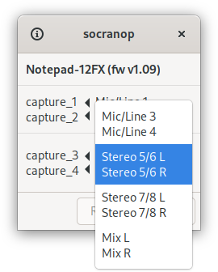
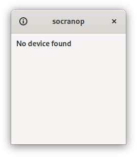

Linux Utilities for Soundcraft Notepad Mixers
=============================================

[Soundcraft Notepad](https://www.soundcraft.com/en/product_families/notepad-series)
mixers are pretty nice small-sized mixer boards with Harmon USB I/O built-in.
While the USB audio works great in alsa/jackd/pipewire without any additional
configuration needed, there are some advanced features available to the Windows
driver that have no Linux equivalent.  Most importantly, the USB routing for
the capture channels is software-controlled, and requires an additional
utility.  For example, by default the Notepad-12FX sends the Master L&R outputs
to USB capture channels 3 and 4, but this routing can be changed to input 3&4,
input 5&6, or input 7&8.  This tool aims to give this same software control of
the USB capture channel routing to Linux users.

Supported models:
- Notepad-12FX
- Notepad-8FX
- Notepad-5


About the Name
--------------

**SO**und**CRA**ft **NO**te**P**ad

This software was originally written and published as
[soundcraft-utils](https://soundcraft-utils.github.io), but was renamed and
updated in 2021.  Version 0.4 of soundcraft-utils is considered end-of-life,
and will be expunged from the internet after an appropriate mourning period has
expired.

This renamed and updated version is still maintained by the original authors,
under the [socratools](https://github.com/socratools) organization.

### Legacy Upgrades

If you're upgrading from soundcraft-utils, this version is different enough
that it's worth uninstalling the soundcraft-utils and doing a fresh install of
socranop as outlined below.


Usage
-----

### GUI

The XDG desktop launcher should be installed by default, and most XDG-aware
application launchers should allow launching via a beautiful technicolor icon
alongside all your other favorite GUI applications.

The GUI can also be started manually via:

```sh
socranop-gui
```

#### Usage Tips

- Select the desired input using the up and down arrow keys or using the mouse
- Apply the selection by clicking "Apply" (ALT+A)
- Instead of applying the selection, clicking "Reset" (ALT+R) will set the
  selection back to the current state of the mixer (if known)
- See the "About socranop" dialog from the burger menu or app menu (CTRL+B)
- Quit the socranop GUI by closing the window (or CTRL+Q)


#### Screenshots






### CLI

List possible channel routing choices:

```sh
socranop-ctl --list/-l
```

Set channel routing:

```sh
socranop-ctl --set/-s <number>
```

See `socranop-ctl --help` or `man socranop-ctl` for more details.

#### Sample Output

```
[user@host ~]$ socranop-ctl --list
Detected a Notepad-12FX (fw v1.09)
-----------------------------
capture_1 <- Mic/Line 1
capture_2 <- Mic/Line 2
-----------------------------
             Mic/Line 3   [0]
             Mic/Line 4
             Stereo 5/6 L [1]
             Stereo 5/6 R
capture_3 <- Stereo 7/8 L [2]
capture_4 <- Stereo 7/8 R
             Mix L        [3]
             Mix R
-----------------------------
[user@host ~]$ _
[user@host ~]$ socranop-ctl --set 3
Detected a Notepad-12FX (fw v1.09)
-----------------------------
capture_1 <- Mic/Line 1
capture_2 <- Mic/Line 2
-----------------------------
             Mic/Line 3   [0]
             Mic/Line 4
             Stereo 5/6 L [1]
             Stereo 5/6 R
             Stereo 7/8 L [2]
             Stereo 7/8 R
capture_3 <- Mix L        [3]
capture_4 <- Mix R
-----------------------------
[user@host ~]$ _
```

### D-Bus Service

The D-Bus service runs on the user's session bus unprivileged, and relies on
he proper udev device permissions to access the USB device to make changes.
See [PERMISSIONS.md](PERMISSIONS.md) for a more in-depth discussion about the
udev permission requirements, and alternative ways of granting the required
privileges.

You can access the D-Bus service directly if you like; see
[contrib/dbus/access-dbus-service.sh](contrib/dbus/access-dbus-service.sh) for
an example using busctl, but any D-Bus client can do it.

Because both the GUI and CLI perform their operations via the D-Bus service,
any changes made through any client are immediately visible to all other
clients.


Installation
------------

Note: This covers manual installation of the pypi package via pip.
For distro-specific packages see [the section
below](#distro-specific-packages).  For installing from source code,
see [the HACKING.md file](HACKING.md).

### Overview

`socranop` is written in Python and interfaces to Linux
systems in a few ways. This means that the Python code itself is very
well handled by Python's default installation methods, but the
interface to the Linux system is not.

Therefore, at this time, the `socranop-installtool` utility must be
called in addition to the normal Python tools for installing
(`socranop-installtool post-pip-install`) and uninstalling
(`socranop-installtool pre-pip-uninstall`). This hooks `socranop` into
the Linux system components like the D-Bus session bus and the desktop
environment's list of applications.

If you are installing `socranop` from a distribution package, that
distribution package should do all that for you.

For the D-bus and XDG Desktop interface, `socranop` supports the
following three installation locations:

  * `/usr`

    The location probably used only by distro packages.

  * `/usr/local`

    The location probably used for system-wide installations from pypi
    or github sources, or by distro packages.

  * `$HOME/.local`

    The location probably used for user-local installations from pypi
    or github sources.

In all three cases, the `udev` rules to set the USB device permissions
for the user need to be installed as well.  Again, a distro package
should already have done that for you, but if you are installing via
`pip`, this step needs to be done as root.  The `socranop-installtool`
will generate for you a script with commands to run as root.  This
allows you to inspect the script first to make sure it only does
things you approve of.

### Prerequisites

The D-Bus service and the GTK GUI both rely on
[PyGObject](https://pygobject.readthedocs.io/en/latest/index.html) which is not
available via pypi without a lot of dev libraries for it to compile against.

It is usually easier to install `PyGObject` separately using your
system's package installation tools (first line in the install
examples below). And while you're at it, you could also install the
system's Python dbus and usb packages and save a bit more of compiling
(second line in the install examples below):

Debian and Ubuntu:
```sh
sudo apt install python3-pip
sudo apt install python3-gi gir1.2-gtk-3.0 gir1.2-gudev-1.0
sudo apt install python3-pydbus python3-usb
```

Fedora:
```sh
sudo dnf install python3-pip
sudo dnf install python3-gobject gtk3 libgudev
sudo dnf install python3-dbus python3-pyusb
```

### Installation and Configuration

The installation may be done as root to install system-wide, or as a
normal user to install in `~/.local`.  Regardless of how it's
installed, `socranop-installtool post-pip-install` needs to be run to
configure the D-Bus service, XDG desktop entry, man pages, etc.
However, it can only do part of the work on its own and relies on a
manual invocation of a script as root to finish setting up the UDEV
rules.

See [PERMISSIONS.md](PERMISSIONS.md) for a more in-depth discussion about the
udev permission requirements, and alternative ways of granting the required
privileges.

#### Example

```sh
pip install socranop
socranop-installtool post-pip-install --sudo-script ./socranop-sudo.sh
# Inspect ./socranop-sudo.sh to make sure it's safe to run as root
sudo ./socranop-sudo.sh
rm ./socranop-sudo.sh
```

### Upgrading

Simply update your package from pip, and rerun `socranop-installtool
post-pip-install` to ensure the D-Bus service, XDG desktop entry, man pages, etc.
are upgraded to the latest version.

It is not normally required to update the udev rules after an upgrade, but if
changes need to be made, they need to be run manually as root, and the script
will guide you through.

#### Example

```sh
pip install --upgrade socranop
socranop-installtool post-pip-install
```

### Uninstallation

`socranop-installtool` can take care of undoing what it did in
`post-pip-install` via its `pre-pip-uninstall` command: Remove the
D-Bus service file, XDG desktop entry, man pages, etc.  Any actions
that would need to be taken by root, such as removing the udev rules,
are again placed in a script that needs to be run manually.

#### Example

```sh
socranop-installtool pre-pip-uninstall --sudo-script ./socranop-sudo.sh
# Inspect ./socranop-sudo.sh to make sure it's safe to run as root
sudo ./socranop-sudo.sh
rm ./socranop-sudo.sh
pip uninstall socranop
```

### Distro-specific Packages

The previous version of this software, called `soundcraft-utils` had Arch Linux
and NixOS packages.  These will have to be re-done with the rename to
`socranop`.

Distro-specific packages will not require the user to run
`socranop-installtool` and should instead install everything
system-wide with appropriate udev permissions.  See
[PACKAGING.md](PACKAGING.md) for details.


Contact us
----------

To submit ideas or bugs, and see what we're working on next, see the [socranop
issues page](https://github.com/socratools/socranop/issues)

To chat with us on IRC, join the
[#socratools](https://web.libera.chat/?channel=#socratools) channel on
[libera.chat](https://libera.chat).


Related web links
-----------------

  * https://github.com/socratools/socranop

    The GitHub `socranop` project page.

  * https://pypi.org/project/socranop/

    The pypi `socranop` project page.

  * https://socratools.github.io/

    The `socratools` project page.

  * https://github.com/socratools/socradoc

    The GitHub `socradoc` project page. `socradoc` documents the USB
    protocol used to control the Notepad series of mixers.
